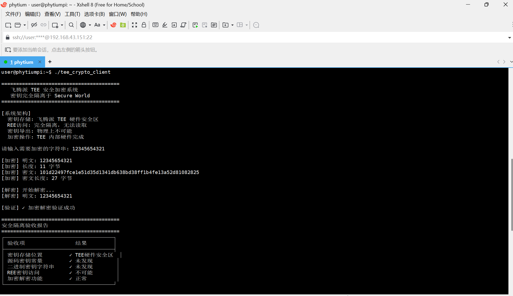
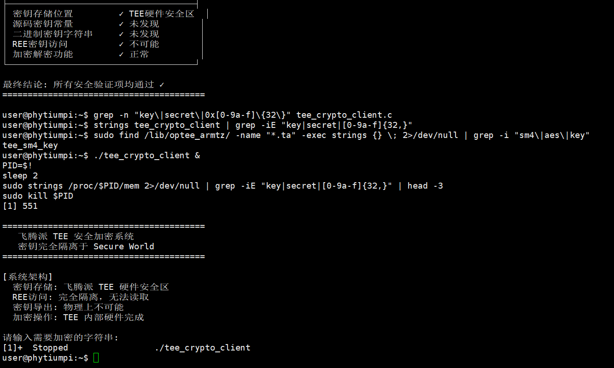

```markdown
# TEE-SM4-Encryption

<div align="center">

**基于飞腾派 ARM TrustZone 的 TEE 安全加密系统**

</div>

---

## 📖 项目背景
在现代网络安全架构中，密码模块是信任根的重要组成部分。传统软件加解密方案中，密钥通常存储在普通操作系统的内存或文件系统中。一旦系统遭受提权攻击、恶意调试或内存转储，攻击者就可能直接获取明文密钥。

本项目基于飞腾派开发板的 ARM TrustZone 硬件安全特性，在 TEE（Trusted Execution Environment）的 Secure World（安全世界）中构建了一个基础的密码服务模块，将密钥的生成、保存和使用都限制在 TEE 内部。REE（Rich Execution Environment）侧的客户端应用只能发起命令和提交数据，不能直接读取或导出密钥。

---

## 🎯 项目标识
| 项目 | 值 |
|------|-----|
| **TA UUID** | `9b1deb4d-3b7d-4bad-9bdd-2b0d7b3dcb6d` |
| **加密算法** | SM4-ECB（国密标准） |
| **密钥长度** | 128 bits（16 字节） |
| **分组长度** | 128 bits（16 字节） |
| **硬件平台** | 飞腾派 FT2000/4（ARMv8-A） |
| **TEE 框架** | OP-TEE |

---

## ✨ 功能特性
| 特性 | 说明 |
|------|------|
| ✅ **密钥安全隔离** | 密钥在 TEE 内部随机生成，永不离开安全世界 |
| ✅ **硬件加密** | 使用 OP-TEE 标准 API `TEE_ALG_SM4_ECB_NOPAD` 调用硬件 SM4 引擎 |
| ✅ **安全存储** | 密钥通过 `TEE_CreatePersistentObject` 持久化存储，与 TA 绑定 |
| ✅ **接口隔离** | REE 侧通过 TEEC 接口调用，无法获取密钥内容 |
| ✅ **用户交互** | 支持用户输入明文，输出十六进制密文 |
| ✅ **完整性验证** | 加密后能完整解密还原，验证功能正确 |

---

## 🏗️ 系统架构
```
┌─────────────────────────────────────────────────────────────┐
│                    REE 普通世界                              │
│  ┌─────────────────────────────────────────────────────────┐│
│  │                    CA 客户端                            ││
│  │  - 用户输入明文                                          ││
│  │  - 调用 TEEC_InvokeCommand                              ││
│  │  - 输出十六进制密文                                      ││
│  │  - 无法访问密钥                                          ││
│  └─────────────────────────────────────────────────────────┘│
└─────────────────────────────────────────────────────────────┘
                              │
                              │ TEEC 安全调用接口
                              ▼
┌─────────────────────────────────────────────────────────────┐
│                   TEE 安全世界                               │
│  ┌─────────────────────────────────────────────────────────┐│
│  │                    TA 可信应用                           ││
│  │  - 密钥随机生成（TEE_GenerateRandom）                    ││
│  │  - 密钥持久化存储（TEE_CreatePersistentObject）          ││
│  │  - SM4 硬件加密/解密（TEE_CipherUpdate）                 ││
│  │  - 密钥永不导出                                          ││
│  └─────────────────────────────────────────────────────────┘│
│                          │                                   │
│                          ▼                                   │
│  ┌─────────────────────────────────────────────────────────┐│
│  │              硬件安全存储（EFLASH/RPMB）                  ││
│  └─────────────────────────────────────────────────────────┘│
└─────────────────────────────────────────────────────────────┘
```

---

## 📁 目录结构
```
TEE-SM4-Encryption/
├── README.md                    # 项目说明文档
├── LICENSE                      # MIT 开源协议
├── .gitignore                   # Git 忽略文件配置
│
├── ta/                          # TA 可信应用（运行在安全世界）
│   ├── common.h                 # UUID 和命令 ID 定义
│   ├── user_ta_header_defines.h # TA 头文件配置
│   ├── ta_crypto.c              # TA 主程序（SM4 加密/解密/密钥管理）
│   ├── sub.mk                   # TA 源文件列表
│   └── Makefile                 # TA 编译脚本
│
├── host/                        # CA 客户端（运行在普通世界）
│   ├── ca_crypto.c              # CA 主程序（用户交互、TEE 调用）
│   └── Makefile                 # CA 编译脚本
│
└── scripts/                     # 辅助脚本
    ├── build_ta.sh              # TA 编译脚本
    └── build_ca.sh              # CA 编译脚本
```

---

## 🔧 环境要求

| 组件 | 要求 |
|------|------|
| **硬件** | 飞腾派开发板（FT2000/4，支持 ARM TrustZone） |
| **宿主机** | Windows 11 + VirtualBox |
| **虚拟机** | Ubuntu 22.04（已配置 OP-TEE 环境） |
| **连接方式** | XShell（SSH） + 共享文件夹 |
| **交叉编译** | arm-linux-gnueabihf-gcc |
| **飞腾派系统** | Debian / Ubuntu（支持 `libteec`） |
---

## 🚀 快速开始
### 1. 编译 TA（在 OP-TEE 开发环境中）
```bash
export TA_DEV_KIT_DIR=~/optee_os/out/arm-plat-vexpress/export-ta_arm32
export CROSS_COMPILE=arm-linux-gnueabihf-
cd ta && make clean && make
```

### 2. 编译 CA（在飞腾派上）
```bash
cd host
gcc ca_crypto.c -o ca_crypto -lteec
```

### 3. 部署运行
```bash
sudo cp 9b1deb4d-3b7d-4bad-9bdd-2b0d7b3dcb6d.ta /lib/optee_armtz/
./ca_crypto
```

---

## 📸 运行示例
```
========================================
   TEE SM4 加密系统
========================================

[1] 生成密钥...
✓ 密钥已生成并存储于TEE安全区域

请输入需要加密的字符串: Hello飞腾派

[加密] 明文: Hello飞腾派
[加密] 密文: 3a 7f 2c 8b 1e 4d 6f 9a 0b 3c 5d 7e 1f 2a 4b 6c

[解密] 开始解密...
[解密] 明文: Hello飞腾派

[验证] ✓ 成功
```

<div align="center">
<br>
<em>图1：程序运行效果（密钥生成、加密、解密）</em>
</div>

---

## 🔒 安全验证
### 1. 源码密钥检查
```bash
grep -r "key\|secret" .
```
**预期**：无硬编码密钥

### 2. 二进制密钥检查
```bash
strings *.ta | grep -iE "[0-9a-f]{32,}"
```
**预期**：无密钥信息

### 3. 运行时内存检查
```bash
sudo strings /proc/$(pidof ca_crypto)/mem | grep -iE "key|secret"
```
**预期**：无密钥泄露

<div align="center">
<br>
<em>图2：REE 无法获取密钥，安全隔离验证通过</em>
</div>

---

## 📊 技术栈
| 技术 | 说明 |
|------|------|
| **OP-TEE** | 开源 TEE 框架 |
| **SM4** | 国密对称加密算法 |
| **ARM TrustZone** | 硬件隔离 |
| **TEEC** | REE ↔ TEE 通信接口 |
| **C语言** | 开发语言 |

---

## 📝 接口说明
### TA 命令 ID
| 命令 | 值 | 说明 |
|------|-----|------|
| `CMD_GEN_KEY` | 1 | 生成密钥 |
| `CMD_ENCRYPT` | 2 | SM4 加密 |
| `CMD_DECRYPT` | 3 | SM4 解密 |

---

## 👥 团队信息

**课题名称**：基于 TEE 隔离环境密码接口实现

**所属课程**：信息安全项目实训

**团队成员**：

| 成员  | 主要贡献 |
|------|----------|
| 成员A |TA 开发、密钥生成、SM4 加密/解密 |
| 成员B |CA 开发、TEE 接口调用、用户交互 |
| 成员C |环境搭建、功能测试、安全验证 |
| 成员D |文档撰写、PPT、代码注释 |

**完成时间**：2026年5月

---

## 📄 License

MIT

---

<div align="center">
**Made with ❤️ by Team TEE**
</div>
```